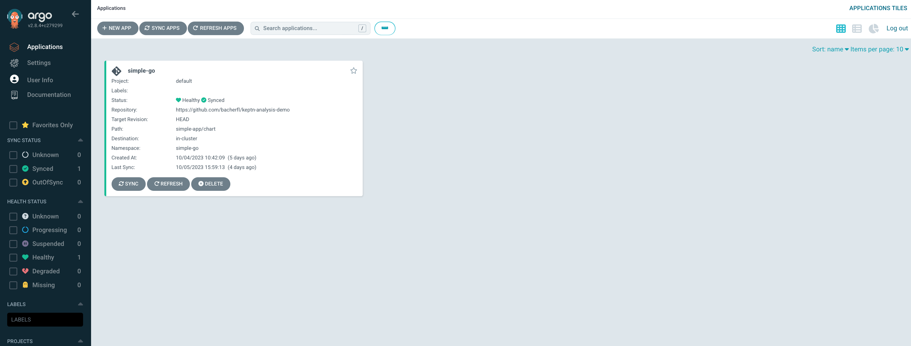
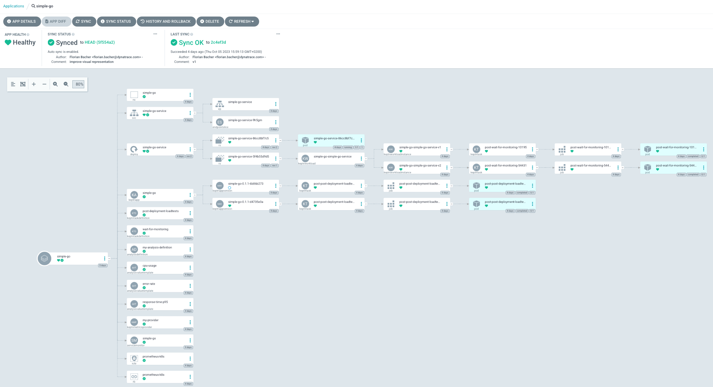
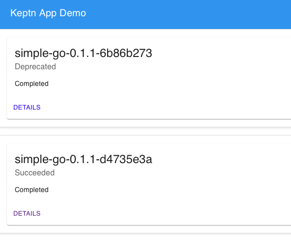
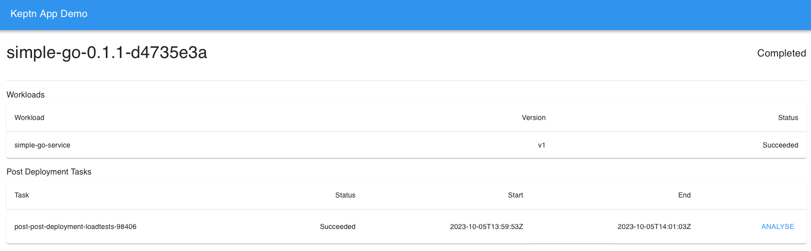
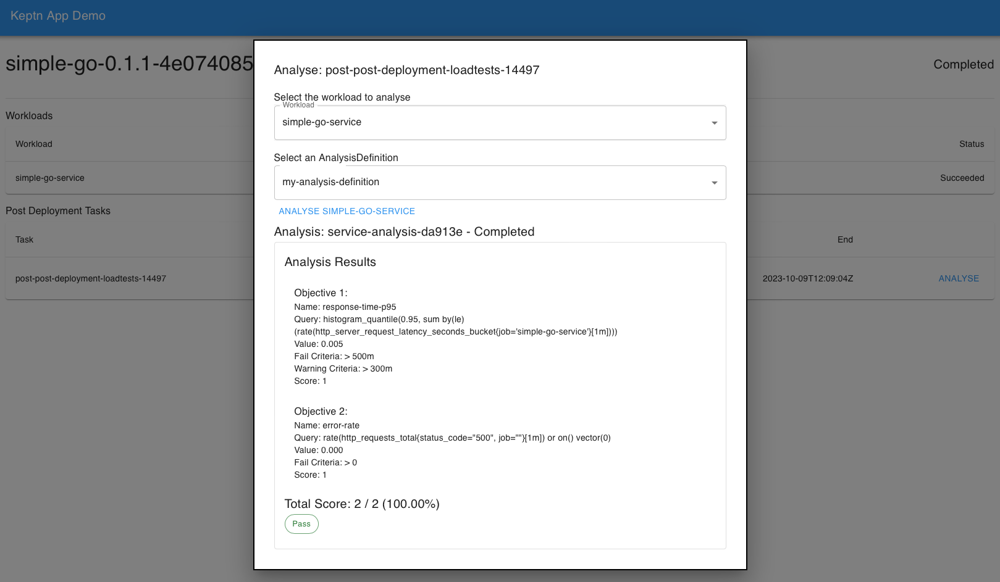

# keptn-analysis-demo

## Synopsis

This Demo highlights the Analysis capabilities of Keptn. The demo includes a sample app containing a simple service (simple-go-service).
During the deployment of the app, several post deployment tasks will be executed:

1. The post deployment task of the `Workload` will make sure the prometheus target of the deployed service is available before proceeding with the app post deployment tasks.
1. The post deployment task of the `Application` will generate some load on the deployed app, to get some monitoring data we can analyse afterwards.

In addition to the app deployment (which can be done either via argo or directly via helm), the demo includes an `AnalysisDefintion` for analysing the `response time` and `error rate` of
the workload within the application. The analysis can be demonstrated either via the `kubectl` CLI or via the web UI included in this demo.

## Prerequisites

The following prerequisites are required and will not be installed automatically by the setup scripts of this demo:

- **Kubernetes Cluster:** This demo has been tested with Kind (v0.20.0) on a v1.27.3 Kubernetes cluster. 

## Installation

Once all requirements mentioned above are met, the cluster can be prepared for the demo using the following command:

```shell
make install
```

This will install Prometheus, Grafana, Jaeger and the Demo UI. Those Services can then be accessed using the `make port-forward-...` commands in the Makefile.
The most interesting services to access for this demo are:

- **Argo:** Can be accessed using `make port-forward-argo`. The UI will ask for credentials, which can be retrieved with `make argo-login`.
- **Demo UI:** This UI serves as a convenient tool to showcase the Analysis features after the the demo app has been deployed. Can be accessed with `make port-forward-demo-ui`.

## Deploying the application with Argo

If Argo should be used for this demo, make sure the target repository for the app is correct one. This will not be the case, if the upstream repository for this demo will be forked from this demo. If required, the upstream git repo for the sample application can be modified in `./support/argo/config/app.yaml`.
Once that is set up, the Argo app can be deployed using the following command:

```shell
make argo-install-simple-go
```

Eventually, the app will be visible on the argo UI



When selecting that application in the UI, the current state of the deployment will be displayed:



Here you will find an overview of how the deployment is coming along.
The most interesting aspects here are the post deployment tasks for the workload and application.

Argo will also keep observing the upstream repo for any changes in the application configuration.
For example, the `values.yaml` file in `./simple-app/chart/values.yaml` contains a parameter called `serviceVersion`, which can be set to `v2` to deploy a slow version of the demo service.

Once everything is deployed, it is time to show the Analysis feature.

## Triggering Analyses

To trigger an Analysis, you can either apply the manifest found in `./simple-app/analysis-instance` (which is a good
way of showcasing the emphasis on controlling everything with custom resources), or with the demo UI included in this demo.
The UI can be accessed as follows:

```shell
make port-forward-ui
```

WHen navigating to the UI, you will be greeted with a list of `KeptnAppVersions` within the `simple-go` namespace, including some general info on their current state. Please note that there is no auto-reload implemented currently,
so manual refresh is required if the AppVersions are currently being deployed.



When clicking on one of those, you will be redirected to the details of that `KeptnAppVersions`, where you will also see the workloads that are part of the app, as well as post-deployment tasks that have been executed. Note: Currently only post-deployment tasks will be displayed, as onle those are defined in the demo, and the UI is tailored to this.



Next to the post deployment task (the load tests) you will find an `Analyse` button, which will guide you through
the process of triggering an Analysis. For this, you will need to select the workload and the `AnalysisDefinition`
to be used for the analysis. An AnalysisDefinition for evaluating the response time and error rate of the deployed service is included in this demo, but can be extended as desired.

Once the created Analysis is finished, the UI will display its results, containing the actual queries used
for the retrieval of values, and the values themselves:


